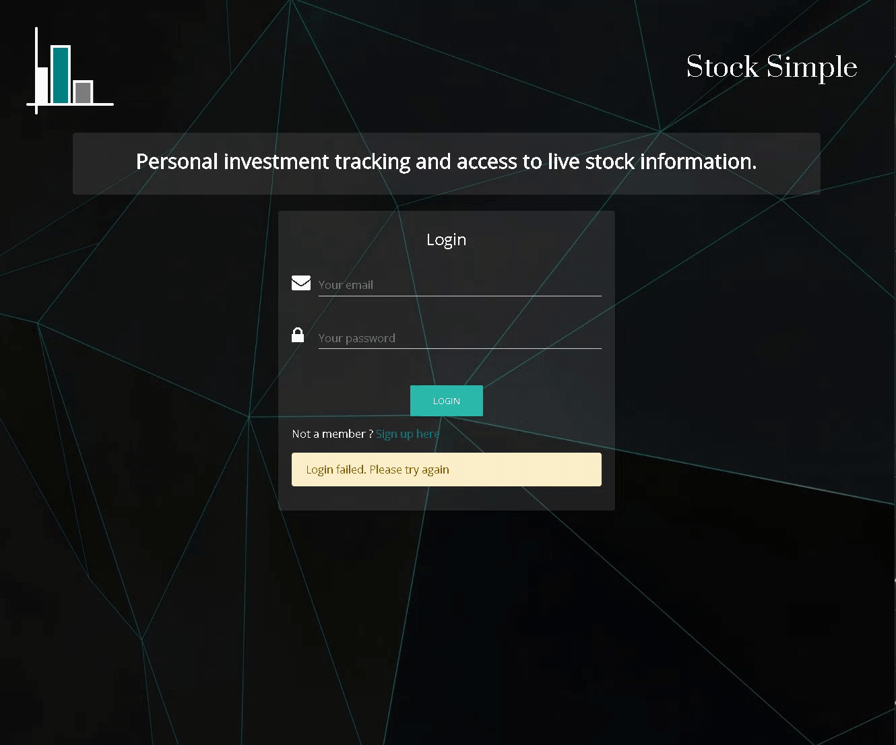
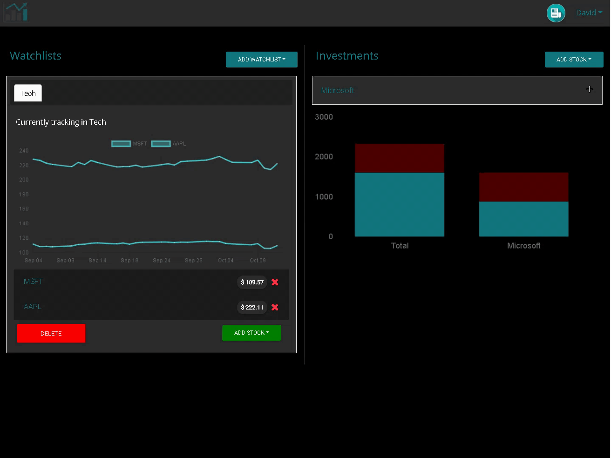
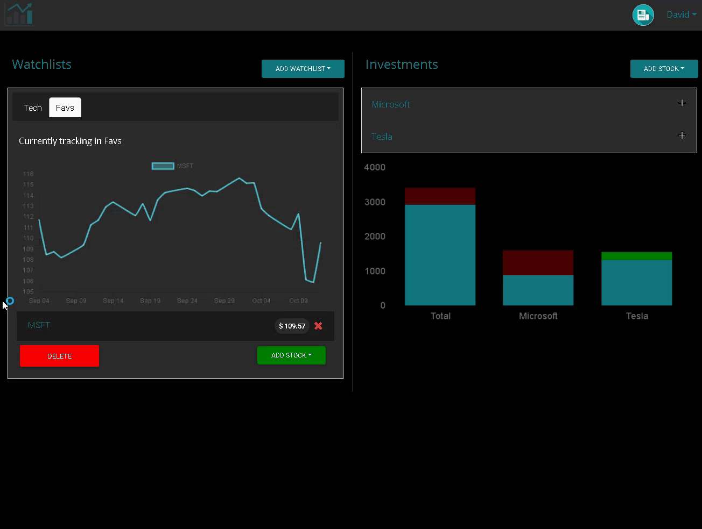
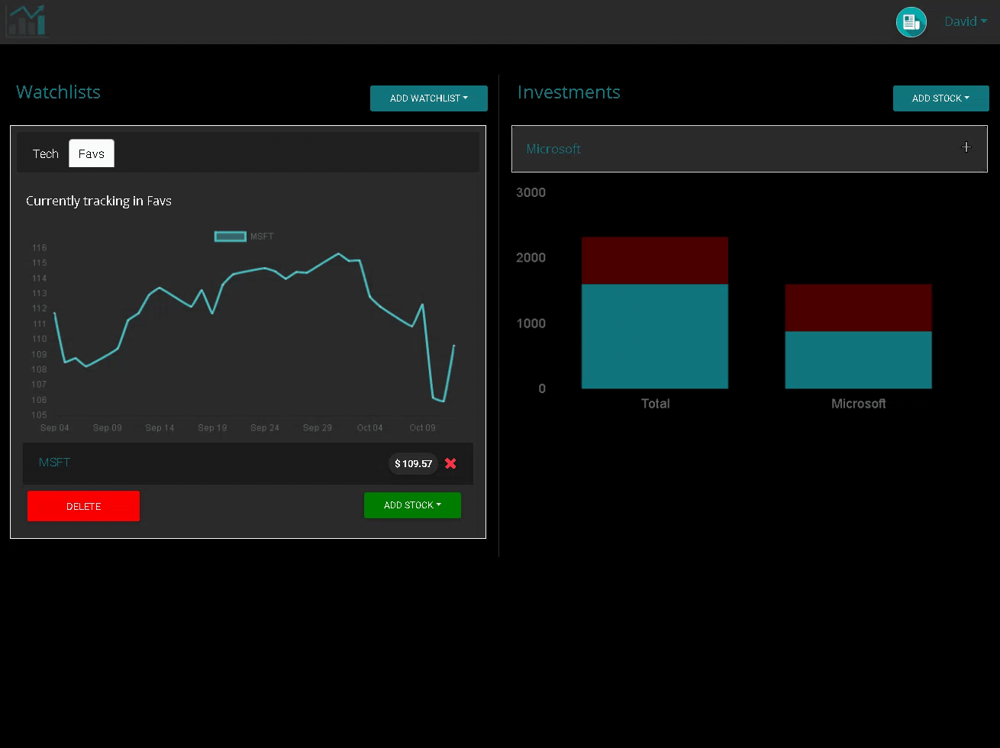

## Stock Simple
This is a Full Stack web application that provides a simple and inituive tool for people to engage with the stock market. Users can sign up, track stocks, set up watchlists, test investment strategies, and view the latest news from the stock market. 

***

## Motivation
We decided to make this app because we found that so many of the popular stock related web and mobile applications are complicated and not accessible to the average user. Furthermore, few of these applications allow users to test their investment strategies without using actual money. For these reasons we decided to make a web application thats strips away unnecessary information and allows for interaction with the stock market with no headaches. 


## Code style
This project follows the Model-View-Controller architecture by sepearting the business logic of the application from the user interface. This allows for modulated code that is easier to maintain and significantly more scalable.

## Screenshots

### Login
***



### Track stocks with watchlists
***



### View the latest news
***



### Search for stocks and save articles
***


### Test and track your investments
***




## Tech/framework used

<b>Built with</b>
- [React.js](https://reactjs.org/)
- [Node.js](https://nodejs.org/en/)
- [MongoDB](https://www.mongodb.com/)
- [Robot 3T](https://robomongo.org/)
- [Mongoose ORM](https://mongoosejs.com/)
- [Express Web Server](https://expressjs.com/)
- [Passport.js](http://www.passportjs.org/)
- [Yarn Package Manager](https://yarnpkg.com/lang/en/)
    - [Cheerio](https://www.npmjs.com/package/cheerio)
    - [Request Promise](https://www.npmjs.com/package/request-promise)

## Features

<b>What separates Stock Simple</b>
- Users can test their investments without having to use actual money. 
- The webiste is mobile responsive, and so can be used on any smartphone. 
- Simple and inituive data visualization 

## Check it out here
If you want to see it live, check it out  [here](https://stocksimple.herokuapp.com)

## Installation

### If you want to try this app on your local computer, or make your own copy: 

<b>First Install some necessary tools</b>
- [React.js](https://reactjs.org/)
- [Node.js](https://nodejs.org/en/)
- [Yarn Package Manager](https://yarnpkg.com/lang/en/)
- [Robot 3T](https://robomongo.org/)


```
1. Fork the repository and clone it into a folder on your computer. 
2. Navgiate to the root directory and run 'yarn install' in the terminal'
3. Go into your Robo 3T Mongo client and create a database called 'stockSimple'. 
4. Navigate back to the terminal and run 'yarn populate' to seed the database. 
5. You will have a test profile in the database with the email 'test@email.com' and the password 'testpassword'.
6. Go to www.worldtradingdata.com and get a free API key. 
7. Create a .env file and add 'WORLDTRADINGDATA_API_KEY='<yourapikey>'. 
8. Run 'yarn start' in the terminal and your site will open on http://localhost3000. 
```


## Authors

* **Derek Irwin** - (https://github.com/derekirwin)
* **David Lapadula** - (https://github.com/davidlapadula)

## Acknowledgments

* Hat tip to our instructor, the TA's at the University of Toronto and several of our colleagues who had the kindness to share their knowledge with us along the way! 
* Inspiration and thanks to [stackoverflow](https://stackoverflow.com/).

- 

